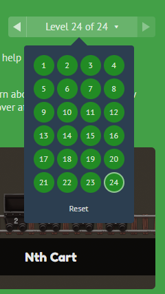

# **my-notes**

## LAB-04 part 2: Flexbox :

## **About me :**
    Computer Engineering Student (M.Sc) with solid experience in SQL Server Database and a solid understanding of various AI fields, including machine learning, deep learning, computer vision, natural language processing, and reinforcement learning. I seek to develop a long-term career in building Artificial Intelligence Solutions and applications.

## **What I Learned From This [link](https://www.freecodecamp.org/news/learn-the-fundamentals-of-a-good-developer-mindset-in-15-minutes-81321ab8a682/) :**

### Each developer must have a mindset that will help him make better decisions in your programming journey and Here are the key points : 

    
####  **Conceiving The Purpose of Software :**

    you should understand the purpose of the software and When you are making decisions about the software you need to think about how the real scenario will be

####  **The Goals of Software Design :**

    The main goal of software design is to make the developer's job as easy as possible so they can focus on creating software that will help users. A well-designed system can be created and maintained easily by developers, which will make it helpful for users for a long time. On the other hand, a poorly designed system will have a short lifetime and will not be as helpful to users. So, the software design should be easy to maintain for developers and helpful for the end-users.

####  **(Mis)understanding :**

    Developers who don't understand their work well create complex systems.

####  **Simplicity**

    A developer who creat good designs systems and the code is easy to understand, making it effortless to locate and fix bugs.

####  **Complexity :**

    When making software, it's important to know what it's for and keep it simple. When new ideas or changes come up, think about if they fit with what the software is for and if they are really needed.

####  **Maintenance :**

    How easy it is to take care of software depends on how simple or complex it is. Simple software is easy to maintain and complex software is hard to maintain.

####  **Consistency :**

    use standard in your system

####  **Prioritizing :**

    When working on software, it is important to prioritize and focus on the most important tasks first. When deciding which tasks to work on, consider how desirable the change is, how valuable it is, and how much effort it will take to complete it.

####  **Solving Problems**

    To solve a difficult problem in software development, it is important to understand the problem first. Next, plan before taking action. Give your brain time to analyze the problem, but don't spend too much time on planning. Divide the problem into smaller tasks and solve each one separately. Once you solve each sub-problem, connect them together.
    
####  **Good enough is fine :**

    In the beginning, the product or feature should meet the minimum requirements and be functional after that you can improve 

####  **Predictions**

    Keep your code efficient by avoiding overly general predictions in software development. Only predict what is essential to make current decisions

####  **Assumptions**

    Design your code based on current information, not on uncertain future events.

####  **Stop Reinventing :**

    Don't waste time and resources by creating something that already exists. Use existing solutions whenever possible

####  **Resistance :**

    As a developer, don't add extra things unless they are really needed. Only make changes that match the main goal of the software and make sure they are important before making them. This helps to keep the software working well.

####  **Automation :**

    When you find yourself doing the same thing over and over automating it by setting them up once and allowing them to run independently

####  **Code measurement :**

    The optimum code is a small bunch of code that is easy to understand, easy to read

####  **Productivity**

    Your main goal should be keeping your code base as small as possible

####  **Testing**

    Make sure your code is tested and works before sharing it with others on the team.

####  **(Under)Estimation :**

    Everything takes longer than you think

    Divide big tasks into smaller parts to make them easier to estimate, even though it may not be 100% accurate, it will be more accurate than trying to estimate a big project as a whole.

    

####  **Running Away From Rewriting :**

    it is important to know that rewriting the code is not always the best solution

####  **Documentation and Commenting :**

    When writing code, don't just explain what it does, but also explain why you did it. Comments should be used to explain the reasoning behind the code, not just what the code is doing. It's also important to have documentation to understand the overall architecture and structure of the software, making it easier for new developers to understand and avoid mistakes.

####  **Picking Technologies (Tools, Libraries, etc.) :**

    When using external technologies in your software development, try to minimize dependency on them as much as possible. This is because they can add complexity and slow down active development

####  **Self-Development :**

    Keep learning and improving every day, it will make a big difference in what you know and can do.

####  **Don’t be a hero :**

    It's better to stop working on something that isn't working out, rather than trying to keep going and being a "hero" about it. Sometimes, quitting and moving on to something else is the best decision.

####  **Don’t Ask Questions… Ask For Help :**

    When you have a task to do and you don't know how .try searching for answers. If you still can't figure it out, ask for help from other people who know more about it.

    